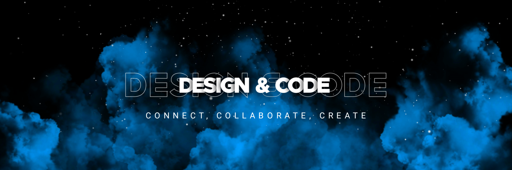

<!--Header Image --->

<!--Welcome Prompt --->

<h1 align="center">
    
</h1>

<!--Github Trophies--->

### Github Trophies 🏆

    

<!--About Me Section--->

### About Me 🚀

I am Hitesh Patil from Maharashtra,India. An energetic and detail-oriented Computer Engineering student on a journey to bridge the digital realm.
Currently seeking opportunities to learn and grow. 

<h2 align="center">  My Tech Stack  </h2>

Here Are My Few Technical Assests Languages, Libraries I know,Tools I use and My Socials. Make Sure you Follow me on Socials So we can Connect and Build a Better Network 🤝💭

### Languages 💡

  

### Competitive Coding Platforms

  
  
  ### Connect With Me 📪
  
          

<!--Github Profile Stats--->
    
<h2 align="center"> My GitHub Stats </h2>
 

  
     
     
  
   
     
   
    
 <!----Profile Views--->
         
<h2 align="center">⚡️Visitors ⚡️</h2>

  

<!---snake gif Available in Assests-->
 

<!--Footer-->
 

